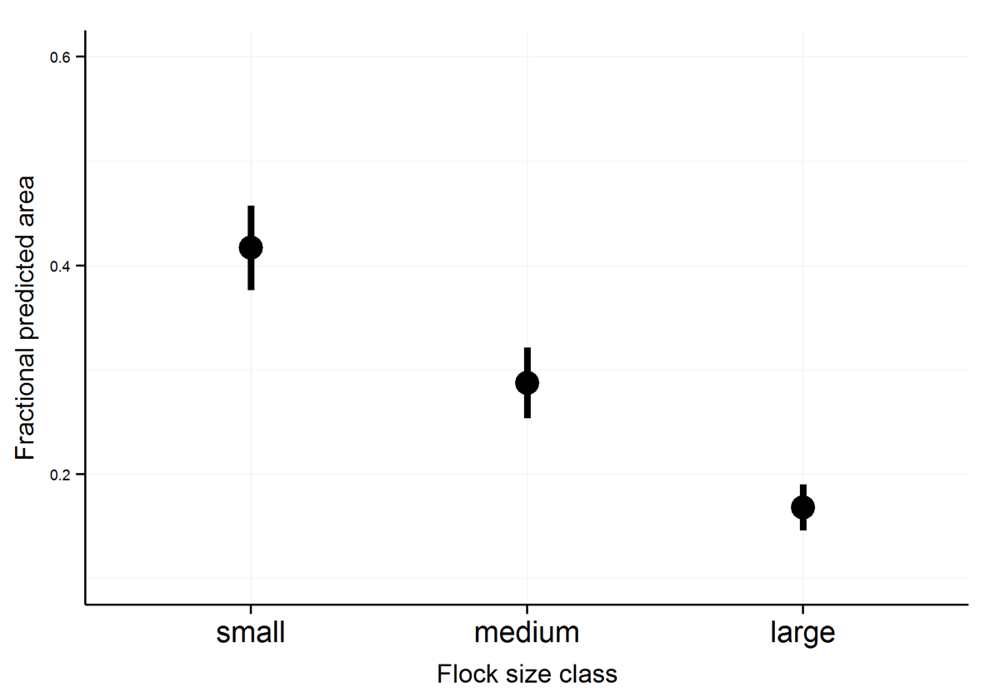
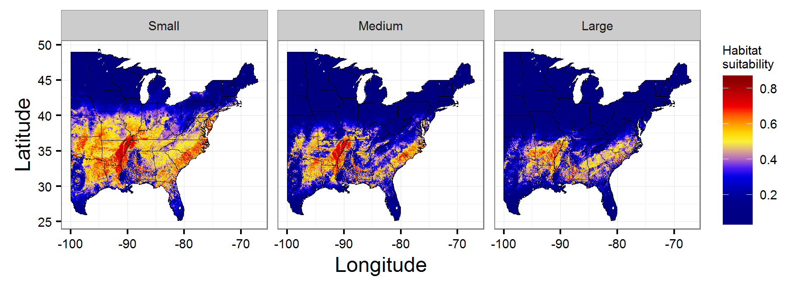
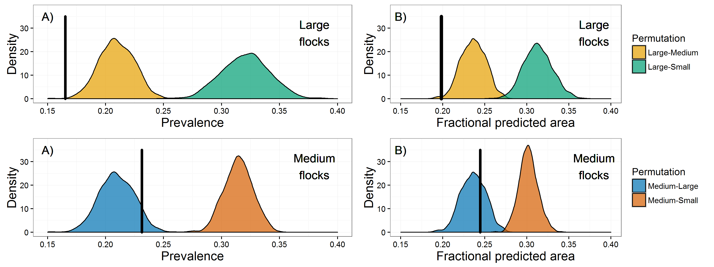
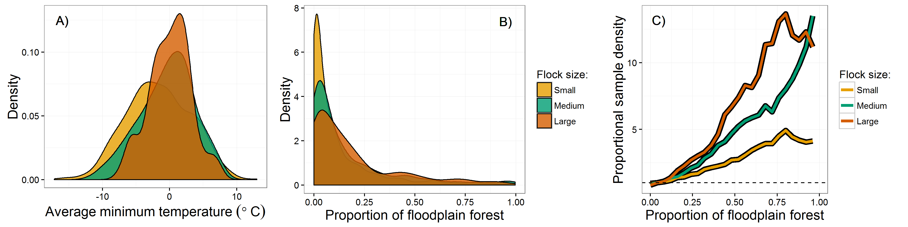

```{r, echo=FALSE}
# setwd('/Users/bsevans/Desktop/gits/blitzAnalysis') # macbook
pathToImages <- 'C:/Users/Brian/Desktop/gits/blitzAnalysis/outPlots/' # desktop
readImages <- function(imageFile){
  imagePath <- paste0(pathToImages, imageFile)
}
```

# Project goals

Abundant in previous centuries, the Rusty Blackbird (_Euphagus carolinus_) is now a rare and declining species (~90% decline since 1966). Declining species present an extraordinary challenge for conservation biologists -- while they are of great conservation concern, difficulties associated with locating individuals and low sample sizes often hamper monitoring efforts. Here, we utilize data from a targeted citizen science program, the Rusty BlackBird Hotspot Blitz, to predict critical habitat for Rusty Blackbird populations on their wintering grounds and during spring migration. To address this, we evaluated the distribution of small (1-19 individuals), medium (20-99 individuals), and large flocks (100 and more individuals) of Rusty Blackbirds in environmental space. Flocking behavior in some species of birds is expected to be fundamental to species perfomance through increasing the ability of birds to access resources (i.e., local enhancement) and reduced predation pressure. Because of this, it is expected that habitats that support large flocks are critical to the population persistence of Rusty Blackbirds. Moreover, the size of social groups represent a trade-off between the benefits associated with acquiring resources relative to the costs of distributing resources across individuals in a flock -- thus it is theorized that large social groups are representative of resource rich habitats while smaller groups represent marginal and resource poor habitats. Our primary objective was to assess differences in the distribution of Rusty Blackbird flocks across climatic and land use variables in order to  identify suitable habitats of Rusty Blackbirds.

# Overview of methods

Assessment of habitat suitability for winter and spring blitz periods required several processing steps, including: processing bird observation data, processing of land cover and climatic data, model development and calibration, model evaluation, and statistical interpretation of models. Because habitat suitability predictions and their interpretation are highly dependent on model construction and implementation, below I provide a brief overview of each of the steps.

* **Processing bird observation data**: Observation data collected by citizen science participants in association with the Spring Migration Blitz (2014-2016), Winter Hotspot Blitz (2009-2011) and those from the larger eBird database were used throughout this analysis. To ensure that collection of eBird and Blitz observations used similar protocols, eBird data were subset such that only traveling counts were considered for this analysis (total lists, Rusty Blackbird: Winter Blitz = 678; winter eBird = 1,429; Spring Blitz = 3,838; spring eBird = 24,197). Because the spatial extent of a study area can bias suitability models and large extents can lead to exaggerated measures model performance, observations were subset to those within the 99th percentile spatial distribution of Rusty Blackbird Observations. Observation data were grouped into sampling periods, with Winter Blitz observations grouped by year and Spring Blitz observations grouped into two-week intervals for each year (March 1 - 14, March 15 - 28, March 29 - April 11, April 12-25, April 26 - May 9;  _Note: sampling continues after May 9 however the sample size was not high enough during this period to construct suitability models_). To maximize independence of samples (i.e., to avoid double-counting individuals) observations were aggregated to a 4 km resolution grid (see below), with grid cells representing the maximum count of Rusty Blackbirds during each sampling period. Finally, because the collection of eBird data is biased towards certain environments (e.g., warmer temperatures and close to human development), we evaluated habitat suitability of presence locations relative to locations in which eBird lists did not contain Rusty Blackbird observations. 

* **Processing land cover and climatic data**: Land cover data were obtained from the USGS National Gap Analysis Program (http://gapanalysis.usgs.gov). These data are provided at a resolution of 30 m with classification of land cover in natural areas dependent on the plant community present at a given site. Land cover data were re-classified to habitat types expected to be predictive of Rusty Blackbird distribution. For each land cover type, we then aggregated the proportional cover to a resolution of 4 km, a spatial resolution thought to be representative of the spatial habitat use by wintering Rusty Blackbirds. Climatic data were obtained from the PRISM Climate Group (http://prism.oregonstate.edu/) and included average daily precipitation and minimum daily temperatures at a resolution of 4 km. Precipitation for winter and spring migration analyses was evaluated as the mean daily precipitation across each sampling period. For the winter analysis, we calculated the average minimum temperature across the period for each year in the study, whereas for the spring analysis we determined the minimum temperature associated with each bird observation. After processing, land cover and climatic data were extracted to bird observation locations.

* **Model development and calibration**: Model development involves fitting the observed distibution of Rusty Blackbirds and observations (eBird lists) that do not include Rusty Blackbirds to the distribution of environmental covariates in a maximum entropy (MaxEnt) modeling framework. Importantly, because these models are developed in environmental rather than geographic space, these models do not predict the probability that a Rusty Blackbird will be present at a given location but rather that the environment at a given location is suitable for Rusty Blackbirds as a function of the distribution of Rusty Blackbird observations. Models were developed separately for each of the three flock size classes. For all variables with the exception of minimum temperature, only linear models were used to describe habitat suitability. A quadratic term for minimum temperature was used to address the expected hump-shaped distribution of Rusty Blackbirds in response to minimum temperatures. Models were calibrated to avoid overfitting by excluding variables that are highly correlated and choosing models with the greatest explanatory power relative to the number of variables used in their construction.

* **Interpretation of models**: Our goals in model interpretation were to determine: 1) How do Rusty Blackbird suitability models perform and did the inclusion of Blitz data improve model performance (formally tested for the Winter Blitz)? 2) Where is Rusty Blackbird habitat most suitable?; 3) Which environmental variables best predict Rusty Blackbird distributions?; and 4) Do large flocks of Rusty Blackbirds occupy a different environmental niche than small and medium size flocks (formally tested for the Winter Blitz)? Model performance is evaluated by comparing model sensitivity (i.e., the true positive rate -- the proportion of correctly identified sampled at a given threshold of habitat suitability) and specificity (the false positive rate -- in species distribution modeling this is described the proportional predicted area for the model at a given threshold of habitat suitability). To address the suitability of habitat, we used the relationship between Rusty Blackbird distributions and environmental covariates to predict suitability models for small, medium, and large flocks of Rusty Blackbirds in environmental space. Models of the relationship between observed distributions in environmental space are used to predict habitat suitability in geographic space (i.e. geographic species distribution models). We then evaluated the contribution of the environmental covariates to model performance to estimate which variable (land cover, predicipation, and minimum temperature) best explains observed Rusty Blackbird distributions. Finally, to address whether different flock size classes occupy a different environmental niche, we tested whether there are differences in relation to the environment in which each flock size class are observed and whether large flocks occupy a narrower niche space than small and medium flocks (i.e., are more constrained in their distribution about the environmental covariates). Further details for each step of this analysis are provided in the results below.

# Summary of results

## 1. Model evaluation

To evaluate the performance of models we assessed the area under the receiver operator curve (ROC, AUC, see Fig. 1A). While the details of AUC are outside of the goals of this document, AUC describes the sensitivity and specificity of models, with values of 0.5 representing equivalent model performance relative to random, 0.7 - 0.8 representing "fair" performance, 0.8 - 0.9 "good" performance, and 0.9 - 1.0 "excellent" model performance. AUC was calculated by separating samples into 5 "folds" of training and test samples and examining how well training samples predict test samples (cross-validation with k-fold partitioning). We found strong evidence that model performance increased with flock size, with fair performance for small flocks and good perfomance for medium and large flocks (across observation methods, Fig. 1B). Because the number of samples used to develop models decreased with flock size, this suggests that larger flocks are observed across a narrower range of the environmental covariates (formally tested in Number 4, below). We tested whether the predictive capacity of models varied by flock size by comparing training AUC across folds for a given flock size class against a null distribution developed by permuting two flock size classes (e.g., suitability models developed by shuffling large and small flock observations). Similarly, to determine whether Blitz data improved model performance  (eBird or Blitz, Winter Blitz only), we compared observed AUC against a null distribution developed by randomizing eBird and Blitz samples. Our findings show that models developed using eBird and Blitz data, combined, performed better than either eBird and Blitz alone (Fig. 1B). With the exception of small flocks, for which Blitz observations had a greater predictive capicity than eBird observations, there was not evidence for a difference in predictive capacity between Blitz and eBird samples. There was, however, strong evidence that the inclusion of Blitz data (i.e., in combined Blitz and eBird observation methods) greatly improved model performance for large and medium flock size classes.


Overall, spring models had higher performance than winter models (Fig. 2), though the predictive capacity of models increasing with sampling period (i.e., AUC increased from March through May) and the predictive capacity of small flocks in the first two sampling periods was rather poor. A possible cause for spring models to outperform winter models is that it may not be appropriate to include observations in the southern part of Rusty Blackbirds' range, as the inclusion of these samples may inflate AUC because few observations are located in this region. To test this, we subset the background points to those within the latitudinal distribution of Rusty Blackbird observations and re-calculated AUC values. While reducing the spatial extent of analysis did decrease the AUC, the observed values remained higher than that of winter flocks. These results suggest that improved Spring Blitz performance relative to the Winter Blitz is not likely not a function of spatial extent and may, rather, be influenced by lower overall habitat suitability across the landscape (i.e., lower prevalence and fractional predicted areas, addressed in Number 4 below).


```{r, out.width = '750px',out.height = '250px', echo = F, fig.align = 'right', fig.cap='test'}
# 
```


## 2. Habitat suitability for small, medium, and large flocks of Rusty Blackbirds

Winter species distribution maps generated for each flock size class (Fig. 2) show hot spots predicted for the southern Mississippi River Basin, the Blackbelt region of Alabama and Mississippi, and the coastal plains of the southeastern United States. Note that the predicted suitability appears to decrease with increasing flock size (formally tested in Number 4, below). Surprisingly, the Piedmont region of the southeastern states appears to be of moderate suitability for large flocks, however, low sample sizes for this flock size class mean that individual samples (e.g., an observation in Piedmont forest) may have an undo effect on estimates of habitat suitability. Spring distribution maps are shown for each sampling period and flock size class in Figure 3. Here, we see similar distributions to winter flocks at the start of the Spring Blitz and a clear shift during migration by which small regions of the geographic extent are predicted to be suitable, especially for large flocks.



```{r, out.width = '750px',echo = F, fig.cap='Spring habitat suitability predictions for small medium, and large flock size classes across observation periods, generated using precipitation and minimum temperatures during 2014.'}
knitr::include_graphics("outPlots/placeholder_suitability.png")
```

## 3. The contribution of environmental variables to habitat suitability 

To determine which environmental variables best predict Rusty Blackbird distributions for each flock size class, we compared the contribution of each variable to model performance after calibrating models (see above for model calibration). **Winter**: Across flock size classes minimum temperature had the greatest contribution to predicted habitat suitability  (Fig. 3, left). Amongst land cover characteristics (Fig. 3, right), floodplain forest had the most influence on model performance, with the contribution of this variable to large flock distributions nearly double that of small and medium-sized flocks. The predicted suitabilility for each flock size class was positively associated with floodplain forest (i.e., $\lambda$ coefficient > 0). Among the remaining variables, row crops and pasture also strongly contributed to model performance across flock size classes ($\lambda$ > 0 for both variables), while the proportion of highly developed land contributed to large flock distributions ($\lambda$ < 0) but not small or medium-sized flocks. **Spring**: Similar to winter predictions, average minimum temperatures had the greatest contribution to suitability models. Because these models are developed during migration and there are several components of migratory movement that are undoubtedly correlated with temperature, however, the suitability distribution of flocks about gradients in minimum temperature cannot be directly assessed. The land cover variables that contributed to Rusty Blackbird distributions varied by sampling period. It is likely that this is because the distribution of available habitats change during the south-to-north migration. Most illustrative of this is the differential influence of the three wetland types: floodplain forest, woody, and emergent (i.e., non-forested) wetlands. For example, though floodplain forests, such as those found in the lower Mississippi river basin, contribute considerably to habitat suitability during the winter and early in the spring migration period, during the later migration periods, woody and emergent wetlands play a dominant role in suitability model predictions. 


## 4. Differences in environmental niche across flock size classes

To assess differences in Rusty Blackbird's environmental distribution across flock size classes, we assessed prevalence (i.e., the average predicted suitability for each map pixel), predicted area of suitable habitat, and compared distributions across and among environmental variables. Prevalence and predicted area of suitable habitat are proxy measures of environmental niche width, as smaller values of each represent a narrower distribution of observations in environmental space. For the Winter Blitz, differences in prevalence and predicted area between flock size classes were statistically evaluated by comparing the observed values for a given flock with a null distribution developed by permuting flock size classes.  In both the Winter and Spring Blitz periods, prevalence decreased with increasing flock size. There was strong evidence that large flocks had lower prevalence than small flocks (Fig. A, top panel), but observed prevalence values for large flocks were statistically indistinguishable from a null distribution of medium and large flock size classes. The observed prevalence of medium-sized flocks was significantly lower than that of small flocks and higher than large flocks (Winter: Fig. A, bottom panel; Spring: Fig.). For spring observations, prevalence decreased from March to May, however, this trend was predominantly driven by a lack of samples in the southern study extent. Despite this, after reducing samples to the 99th percentile latitudinal distribution for each period, prevalence was still shown to decrease across the spring sampling period. Fractional predicted area was calculated at the logistic threshold of equal model sensitivity and specificity and decreased with increasing flock size. During both the Winter and Spring Blitz periods, predicted area for large flocks was significantly lower than small and medium-sized flocks (Winter: Fig. B, top panel, Spring: Fig. ) while the predicted area for medium flocks was statistically indistinguishable from that of small and large flocks (Winter: Fig. B, bottom panel; Spring: ). The fractional predicted area declined across the spring sampling period -- while the extent of this decline was moderated after subsetting samples to those within the 99th percentile of latitude, this pattern remained significant. Combined, our observation that prevalence and fractional predicted area decrease with flock size provide strong evidence that the distribution of larger flocks exhibit a narrower environmental niche than that of smaller flocks. Low and variable prevalence and fractional predicted area estimates across the spring sampling period suggest that suitable habitats may strongly limit distributions during migration.



The distributions of flock size classes across environmental variables were compared for winter flocks by evaluating the niche equivalency among flock size classes (see Fig. 2). We calculated differences in environmental niche as the degree of similarity between habitat suitability maps (modified-Hellinger distance, an index from 0-1 with 1 representing identical environmental niches) and tested whether observed differences were significant by generating and comparing suitability maps developed by randomly permuting flock class labels. We found that flock size classes occupy similar portions of environmental space (e.g., the modified-Hellinger similarity between large and small flocks was 0.89) but the flock size classes still occupied significantly different portions of environmental space. For both Spring and Winter Blitz periods, we compared the observed distributions of flock size classes of wintering Rusty Blackbirds across individual environmental variables using two-tail Kolmogorov-Smirnov tests of the null hypothesis that samples were drawn from the same distribution. Though there was considerably similarities in the distribution of flock sizes about each environmental variable, several differences emerged. For example, Figure 5.A displays the density distribution of the three flock sizes relative to the average minimum temperature for the winter period. We see that all three size classes have a similar temperature profile, however, the width and variance of the distribution decreases with flock size, because medium and large flocks are found in a narrower range of temperatures. Because of this, there was no support for the null hypothesis that the flock size classes are drawn from the same distribution in temperatures. This provides supportive evidence for our hypothesis that large flocks have a narrower environmental niche and occupy a different portion of environmental space relative to medium and small-sized flocks. For land cover variables, such as the proportional cover of floodplain forest, the density distributions can be difficult to interpret due to low overall values across the sampling extent (Fig. 5.B). In Figure 5.C we compare the proportional sample density, which is the density at locations where Rusty Blackbirds of a given flock class were observed, relative to that of the total sampling points (i.e., all eBird lists, including those in which Rusties were observed and those in which they were not). Here, we see that the three flock size classes had a considerably different distribution than each other and the background samples (Note: a proportional sampling density of one represents an equivalent density to the background) -- indeed, there was no support for the null hypothesis that samples from the three flock size classes were drawn from the same underlying distribution.



# Using the Blitz results to inform future research

In this study, we were able to identify key components of the environmental distribution of Rusty Blackbirds on their wintering grounds and during spring migration. We found supportive evidence that environmental niche width decreases with flock size and thus large flocks of Rusty Blackbirds are found in a narrower range of environments than small and medium-sized flocks. This has helped us identify the environmental variables that determine the distribution of the species as well as potential hot spots for Rusty Blackbirds in environmental and geographic space.
