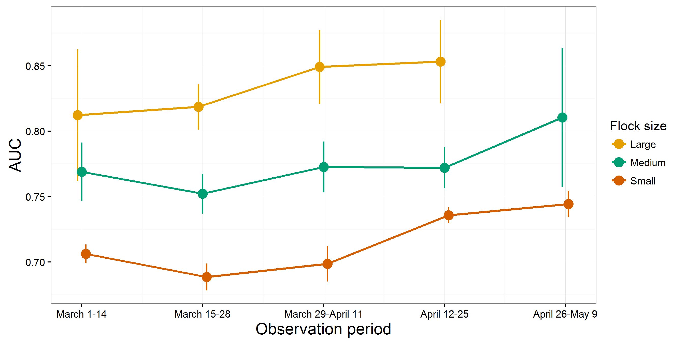
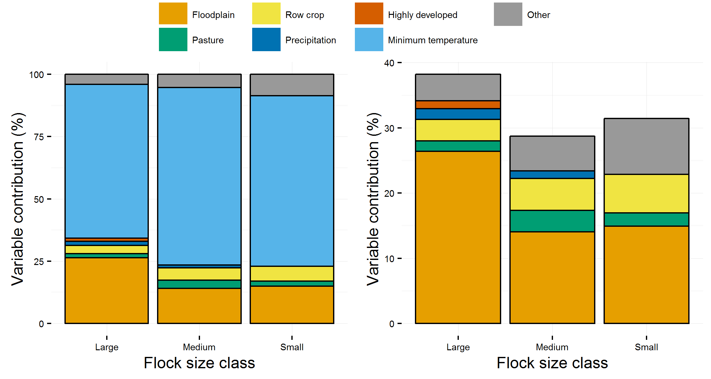
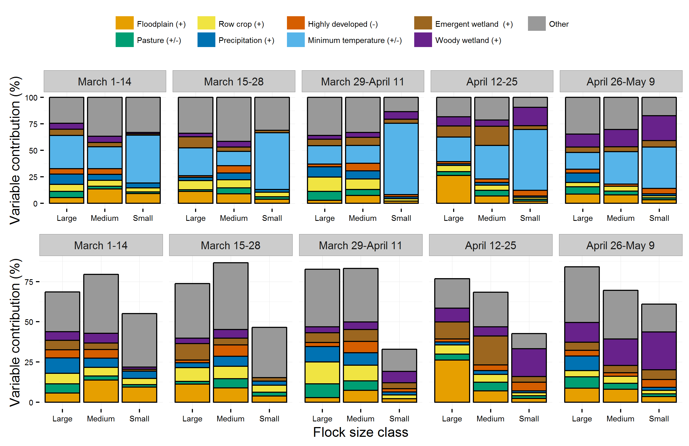
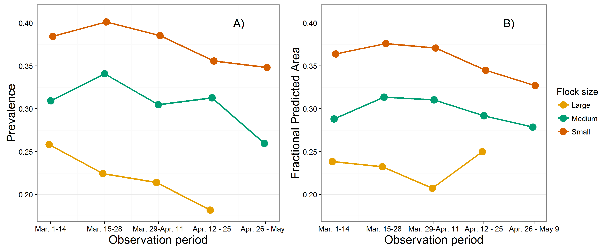
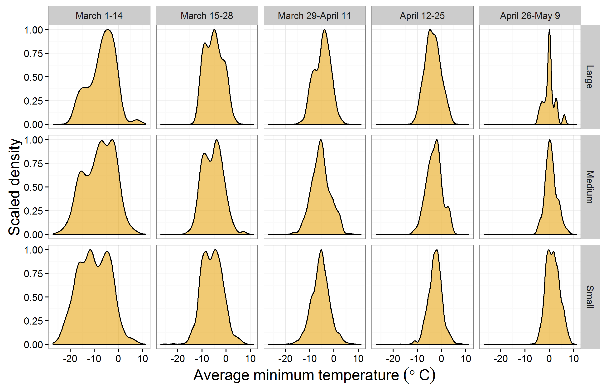

```{r, echo=FALSE}
# setwd('/Users/bsevans/Desktop/gits/blitzAnalysis') # macbook
pathToImages <- '/Users/bsevans/Desktop/gits/blitzAnalysis/outPlots/' # macbook
# pathToImages <- 'C:/Users/Brian/Desktop/gits/blitzAnalysis/outPlots/' # helm
readImages <- function(imageFile){
  imagePath <- paste0(pathToImages, imageFile)
}
```

# Project goals

Abundant in previous centuries, the Rusty Blackbird (_Euphagus carolinus_) is now a rare and declining species (~90% decline since 1966). Rare species present an extraordinary challenge for conservation biologists -- while they are of great conservation concern, difficulties associated with locating individuals and low sample sizes often hamper monitoring efforts. Here, we utilize data from a targeted citizen science program, the Rusty Blackbird Hotspot Blitz, to predict critical habitat for populations on their wintering grounds and during spring migration. To address this, we evaluated the distribution of small (1-19 individuals), medium (20-99 individuals), and large flocks (100 and more individuals) of Rusty Blackbirds in environmental space. The size of flocks at a given location in geographic or environmental space is theorized to be indicative the quality of habitat at that location. Flocking behavior in some species of birds is expected to be fundamental to species perfomance through increasing the ability of birds to access resources (i.e., local enhancement) and reduced predation pressure. Because of this, it is expected that habitats that support large flocks are critical to the population persistence of Rusty Blackbirds. Moreover, the size of social groups represent a trade-off between the benefits associated with acquiring resources relative to the costs of distributing resources across individuals in a flock -- thus it is theorized that large social groups are representative of resource rich habitats while smaller groups represent marginal and resource poor habitats. Our primary objective was to assess differences in the distribution of across climatic and land use variables in order to  identify critical habitats for Rusty Blackbirds.

# Overview of methods

Assessment of habitat suitability for winter and spring blitz periods required several processing steps, including: processing bird observation data, processing of land cover and climatic data, model development and calibration, model evaluation, and statistical interpretation of models. Because habitat suitability predictions and their interpretation are highly dependent on model construction and implementation, below we provide a brief overview of each of the steps. All observation processing and modeling steps are provided in R using scripts located in the Rusty Blackbird Working Group GitHub folder (https://github.com/RustyBlackbirdWorkingGroup/blitzAnalysis/scripts).

* **Processing bird observation data**: Observation data collected by citizen science participants in association with the Spring Migration Blitz (2014-2016), Winter Hotspot Blitz (2009-2011) and those from the larger eBird database during the same sampling periods were used throughout this analysis. To ensure that collection of eBird and Blitz observations used similar protocols, eBird data were subset such that only traveling counts were considered for this analysis (total lists, Rusty Blackbird: Winter Blitz = 678; winter eBird = 1,429; Spring Blitz = 3,838; spring eBird = 24,197). Because the spatial extent of a study area can bias suitability models and large extents can lead to exaggerated measures model performance, observations were subset to those within the 99th percentile of the spatial distribution of Rusty Blackbird observations. Observation data were grouped into sampling periods, with Winter Blitz observations grouped by year and Spring Blitz observations grouped into two-week intervals for each year (March 1 - 14, March 15 - 28, March 29 - April 11, April 12-25, April 26 - May 9;  _Note: sampling continues after May 9 however the sample size was not high enough during this period to construct suitability models_). To maximize independence of samples (i.e., to avoid double-counting flocks) observations were aggregated to a 4 km resolution grid (see below), with grid cells representing the maximum count of Rusty Blackbirds during each sampling period (_Note: Due to sample aggregation, the sample size used to construct and evaluate models was considerably lower. Any reference to sample sizes below will refer the number of samples used in model construction rather than the number of observations themselves._). Finally, because the collection of eBird data is biased towards certain environments (e.g., close proximity to human development), we evaluated habitat suitability of presence locations relative to locations in which eBird lists did not contain Rusty Blackbird observations for each sampling period. 

* **Processing land cover and climatic data**: Land cover data were obtained from the USGS National Gap Analysis Program (http://gapanalysis.usgs.gov). These data are provided at a resolution of 30 m, with classification of land cover in natural areas dependent on the plant community present at a given site. Land cover data were re-classified to habitat types expected to be predictive of Rusty Blackbird distribution (for details regarding reclassification, see https://github.com/RustyBlackbirdWorkingGroup/blitzAnalysis/tree/master/data). For each land cover type, we then aggregated the proportional cover to a resolution of 4 km, a spatial resolution thought to be representative of the spatial habitat use by wintering Rusty Blackbirds. Climatic data were obtained from the PRISM Climate Group (http://prism.oregonstate.edu/) and included daily precipitation and minimum daily temperatures at a resolution of 4 km. Precipitation for winter was evaluated for each sampling period as the mean daily precipitation for winter and total precipitation for spring migration analyses. For the winter analysis, we calculated the average minimum temperature across the period for each year in the study, whereas for the spring analysis we determined the minimum temperature associated with each sampling period (i.e, the minimum temperature during each two week time window). After processing, land cover and climatic data were extracted to bird observation locations.

* **Model development and calibration**: Model development involves fitting the observed distibution of Rusty Blackbirds and observations (eBird lists) that do not include Rusty Blackbirds to the distribution of environmental covariates in a maximum entropy (MaxEnt) modeling framework (https://www.cs.princeton.edu/~schapire/maxent/, executed in R using the package dismo, see: https://cran.r-project.org/web/packages/dismo/vignettes/sdm.pdf). Importantly, because models are developed in environmental rather than geographic space, these models do not predict the probability that a Rusty Blackbird will be present at a given location but rather that the environment at a given location is suitable for Rusty Blackbirds as a function of the distribution of Rusty Blackbird observations. Models were developed separately for each of the three flock size classes. For spring analyses, separate models were also developed for each two week sampling period. For all variables with the exception of minimum temperature, only linear models were used to describe habitat suitability. A quadratic term was used to address the expected hump-shaped distribution of Rusty Blackbirds in response to minimum temperatures. Models were calibrated to avoid overfitting by excluding variables that are highly correlated and choosing models with the greatest explanatory power relative to the number of variables used in their construction.

* **Interpretation of models**: Our goals in model interpretation were to determine: 1) How do Rusty Blackbird suitability models perform and did the inclusion of Blitz data improve model performance (formally tested for the Winter Blitz)? 2) Where is Rusty Blackbird habitat most suitable?; 3) Which environmental variables best predict Rusty Blackbird distributions?; and 4) Do large flocks of Rusty Blackbirds occupy a different environmental niche than small and medium-sized flocks (formally tested for the Winter Blitz)? Model performance is evaluated by comparing model sensitivity (i.e., the true positive rate -- the proportion of correctly identified samples at a given threshold of habitat suitability) and specificity (the false positive rate -- in species distribution modeling this is described the proportional predicted area for the model). To address the suitability of habitat, we used the relationship between Rusty Blackbird distributions and environmental covariates to predict suitability models for small, medium, and large flocks of Rusty Blackbirds and in environmental space. Spring samples were evaluated using separate models of flock size classes and individual sampling periods. Models of the relationship between observed distributions in environmental space are used to predict habitat suitability in geographic space (i.e. geographic species distribution models). We then evaluated the contribution of the environmental covariates to model performance to estimate which variable (land cover, predicipation, and minimum temperature) best explains observed Rusty Blackbird distributions. Finally, to address whether different flock size classes occupy a different environmental niche, we tested whether there are differences in relation to the environment in which each flock size class are observed and whether large flocks occupy a narrower niche space than small and medium flocks (i.e., are more constrained in their distribution about the environmental covariates). Further details for each step of this analysis are provided in the results below.


# Summary of results

## 1. Model evaluation

To evaluate the performance of models we assessed the receiver operator curve which represents the sensitivity and specificity of a model at a given threshold of suitability (ROC, see Fig. 1A).The area under the receiver operator curve represents how well the model predicts the Rusty Blackbird observations with values of 0.5 representing equivalent model performance relative to random, 0.6 - 0.7 representing "poor" performance,  0.7 - 0.8 representing "fair" performance, 0.8 - 0.9 "good" performance, and 0.9 - 1.0 "excellent" model performance. AUC was calculated by separating samples into 5 "folds" of training and test samples and examining how well training samples predict test samples (cross-validation with k-fold partitioning). We found strong evidence that model performance increased with flock size, with fair performance for small flocks and good perfomance for medium and large flocks (across observation methods, Fig. 1B). Because the number of samples used to develop models decreased with flock size, this suggests that larger flocks are observed across a narrower range of the environmental covariates (formally tested in Number 4, below). We tested whether the predictive capacity of models varied by flock size by comparing training AUC across folds for a given flock size class against a null distribution developed by permuting two flock size classes (e.g., suitability models developed by shuffling large and small flock observations). Similarly, to determine whether Blitz data improved model performance  (eBird or Blitz, Winter Blitz only), we compared observed AUC against a null distribution developed by randomizing eBird and Blitz samples. Our findings show that models developed using eBird and Blitz data, combined, performed better than either eBird and Blitz alone (Fig. 1B). With the exception of small flocks, for which Blitz observations had a greater predictive capicity than eBird observations, there was not evidence for a difference in predictive capacity between Blitz and eBird samples. There was, however, strong evidence that the inclusion of Blitz data (i.e., in combined Blitz and eBird observation methods) greatly improved model performance for large and medium flock size classes.

Overall, spring models had lower performance than winter models (Fig. 2), though the predictive capacity of models showed a slight overall increase with sampling period (i.e., AUC increased from March through May) and flock size. The observed variation in Rusty Blackbird distributions relative to the environmental covariates suggest the environemental space occupied declines with increasing flock size and across the migratory period (tested in Number 4, below). A few exceptions to this pattern were observed, however. For example, the predictive capacity of small flock distributions during the second and third sampling periods was poor -- because sample sizes are quite high for these two periods (_N~Small~_, period 2: 1,821 ;_N~Small~_, period 3: 2,232), this suggests that small flock distributions are poorly explained by the environmental covariates during these periods. Additionally, the performance of large flock models could not be evaluated for the final sampling period due to the low sample size of large flocks during this period (_N~Large~_, period 5: 23).

```{r, out.width = '500px',echo = F, fig.align='center',fig.cap='Area under the receiver operator curve (AUC) across flock size and sampling periods for the Spring Blitz, 2014-2016. Error bars represent the 95 percent confidence interval about mean AUC values across cross-validation runs.'}

```

## 2. Habitat suitability for small, medium, and large flocks of Rusty Blackbirds

Winter species distribution maps generated for each flock size class (Fig. 3) show hot spots predicted for the southern Mississippi River Basin, the Blackbelt region of Alabama and Mississippi, and the coastal plains of the southeastern United States. Note that the predicted suitability appears to decrease with increasing flock size (formally tested in Number 4, below). Surprisingly, the Piedmont region of the southeastern states appears to be of moderate suitability for large flocks, however, low sample sizes for this flock size class mean that individual samples (e.g., an observation in Piedmont forest) may have an undo effect on estimates of habitat suitability. Spring distribution maps are shown for each sampling period and flock size class in Figure 4. Here, we see similar distributions to winter flocks at the start of the Spring Blitz and a clear shift during migration by which small regions of the geographic extent are predicted to be suitable, especially for large flocks. As described above, the suitablity map of large flocks during the final sampling period is undoubtedly influenced by the small sample size during this period and should not be viewed as an accurate representation of their distibution. Additionally, distributions during migration are likely heavily influenced by geographic features (e.g., the Great Lakes) and weather events that could not be included within the modeling framework. Distribution maps should thus be used with caution for migratory data and, given the data, methods that evaluate occurrence probability or landscape permeability (e.g., agent-based modeling approaches) may be preferable. 


```{r, out.width = '700px',echo = F, fig.align='center',fig.cap='Spring habitat suitability predictions for small medium, and large flock size classes across observation periods, generated using precipitation and minimum temperatures during 2014.'}
knitr::include_graphics("outPlots/springSuitabilityMaps2014.png")
```

## 3. The contribution of environmental variables to habitat suitability 

```{r, out.width = '350px',echo = F, fig.align='center',fig.cap='Variable contribution by flock size class of the environmental variables most predictive of observed winter Rusty Blackbird distributions. The plot on the left includes minimum temperature while the plot on the right shows variable contributions in the absence of minimum temperature.'}

```

To determine which environmental variables best predict Rusty Blackbird distributions for each flock size class, we compared the contribution of each variable to model performance after calibrating models (see above for model calibration). **Winter**: Across flock size classes minimum temperature had the greatest contribution to predicted habitat suitability  (Fig. 5, left). Amongst land cover characteristics (Fig. 5, right), floodplain forest had the most influence on model performance, with the contribution of this variable to large flock distributions nearly double that of small and medium-sized flocks. The predicted suitabilility for each flock size class was positively associated with floodplain forest (i.e., $\lambda$ coefficient > 0). Among the remaining variables, row crops and pasture also strongly contributed to model performance across flock size classes ($\lambda$ > 0 for both variables), while the proportion of highly developed land contributed to large flock distributions ($\lambda$ < 0) but not small or medium-sized flocks. **Spring**: Similar to winter predictions, average minimum temperatures had the greatest contribution to suitability models (Fig. 6, upper panel). Because these models are developed during migration and there are several components of migratory movement that are undoubtedly correlated with temperature, however, the suitability distribution of flocks about gradients in minimum temperature cannot be directly assessed. The land cover variables that contributed to Rusty Blackbird distributions varied by sampling period (see Fig. 6, lower panel). It is likely that this is because the distribution of available habitats changes during the south-to-north migration. Most illustrative of this is the differential influence of the three wetland types: floodplain forest, woody, and emergent (i.e., non-forested) wetlands across sampling periods. This may suggest that the presence of wetland habitat during migration is more important than the type of wetland present.


```{r, out.width = '500px',echo = F,fig.align='center',fig.cap='Variable contribution by flock size class of the environmental variables most predictive of observed spring Rusty Blackbird distributions. The upper plots on the left includes minimum temperature while the lower plots display variable contributions in the absence of minimum temperature.'}

```

## 4. Differences in environmental niche across flock size classes

To assess differences in Rusty Blackbird's environmental distribution across flock size classes, we assessed prevalence (i.e., the average predicted suitability for each map pixel), predicted area of suitable habitat, and compared distributions across and among environmental variables. Prevalence and predicted area of suitable habitat are proxy measures of environmental niche width, as smaller values of each represent a narrower distribution of observations in environmental space. For the Winter Blitz, differences in prevalence and predicted area between flock size classes were statistically evaluated by comparing the observed values for a given flock with a null distribution developed by permuting flock size classes.  In both the Winter and Spring Blitz periods, prevalence decreased with increasing flock size. There was strong evidence that large flocks had lower prevalence than small flocks (Fig. 7A, top panel), but observed prevalence values for large flocks were statistically indistinguishable from a null distribution of medium and large flock size classes. The observed prevalence of medium-sized flocks was significantly lower than that of small flocks and higher than large flocks (Winter: Fig. 7A, bottom panel; Spring: Fig. 8A) . For spring observations, prevalence decreased from March to May, however, this trend was predominantly driven by a lack of samples in the southern United States. Fractional predicted area was calculated at the logistic threshold of equal model sensitivity and specificity and decreased with increasing flock size. During both the Winter and Spring Blitz periods, predicted area for large flocks was lower than small and medium-sized flocks (Winter: Fig. 7B, top panel, Spring: Fig. 8B) though the predicted area for medium flocks during the winter was statistically indistinguishable from that of small and large flocks (Winter: Fig. 7B, bottom panel; Spring: Fig. 8B). With the exception of the fractional predicted area for large flocks in sampling period four, which had a rather low sample size, the fractional predicted area declined across the spring sampling periods. Similar to prevalence, this is likely enhanced due to a lack of samples in the southern United States. Combined, our observation that prevalence and fractional predicted area decrease with flock size provide strong evidence that the distribution of larger flocks exhibit a narrower environmental niche than that of smaller flocks. Low and variable prevalence and fractional predicted area estimates across the spring sampling period suggest that suitable habitats may limit distributions during migration.




The distributions of flock size classes across environmental variables were compared for winter flocks by evaluating the niche equivalency among flock size classes. We calculated differences in environmental niche as the degree of similarity between habitat suitability maps (modified-Hellinger distance, an index from 0-1 with 1 representing identical environmental niches) and tested whether observed differences were significant by generating and comparing suitability maps developed by randomly permuting flock class labels (winter analysis only). We found that flock size classes occupy similar portions of environmental space (e.g., the modified-Hellinger similarity between large and small flocks was 0.89) but the flock size classes still occupied significantly different portions of environmental space. For both Spring and Winter Blitz periods, we compared the observed distributions of flock size classes of  Rusty Blackbirds across individual environmental variables using two-tail Kolmogorov-Smirnov tests of the null hypothesis that samples were drawn from the same distribution. Though there was considerably similarities in the distribution of flock sizes about each environmental variable, and across sampling periods during the spring, several differences emerged. For example, we found that while the mode of the distributions for all three size classes occupy similar, the width and variance of the distribution decreases with flock size, thus medium and large flocks are found in a narrower range of temperatures (Winter Blitz, Fig. 9A; Spring Blitz, Fig. 10). Because of this, there was no support for the null hypothesis that the flock size classes are drawn from the same distribution in temperatures. This provides supportive evidence for our hypothesis that large flocks have a narrower environmental niche and occupy a different portion of environmental space relative to medium and small-sized flocks. For the spring migration distributions, there were also significant differences between temperature distributions across the migratory period, however, the modes were similar overall (with the exception of the fifth period, which was considerably warmer). For land cover variables, such as the proportional cover of floodplain forest, the density distributions can be difficult to interpret due to low overall values across the sampling extent (Fig. 9B, winter). In Figure 9C we compare the proportional sample density, which is the density at locations where Rusty Blackbirds of a given flock class were observed (winter), relative to that of the total sampling points (i.e., all eBird lists, including those in which Rusties were observed and those in which they were not). Here, we see that the three flock size classes had a considerably different distribution than each other and the background samples (Note: a proportional sampling density of one represents an equivalent density to the background) -- indeed, in regards to floodplain forest there was no support for the null hypothesis that samples from the three flock size classes were drawn from the same underlying distribution. In regards to both winter and spring migration, there was evidence that samples of medium and large flocks were more heavily weighted towards areas of higher floodplain forest cover relative to small flocks. For the Spring Blitz, samples were also significantly weighted towards areas of greater proportional cover of woody and emergent wetlands for medium and large relative to small flocks. Combined, this provides further evidence that wetland habitats are crucial during winter (floodplain forest) and throughout spring migration (across wetland habitat types).


```{r, out.width = '450px',echo = F, fig.align='left',fig.cap='Scaled density distributions for the Spring Migration Blitz for average minimum temperatures across each observation period and flock size class.'}

```

# Using the Blitz results to inform future research

It is necessary to identify a few caveats regarding limitations with this analysis. First, though subsetting the background data to eBird lists for a given period allowed us to account for bias associated with geographic variation in eBird sampling, this did not account for variation in sampling intensity amongst grid cells. This becomes especially problematic in regards to traveling counts in which lists represent different distances traveled by observers. Additionally, traveling counts may span multiple grid cells, which reduces the predictive capacity of our models. To address this, it is recommended that future Blitz efforts utilize stationary counts. Additionally, in regards to sampling periods during the Spring Blitz, we encountered sample size limitations that reduced our ability to make adequate predictive models (e.g., large flocks from April 26 - May 9). Such limitations may be overcome by explicitly including a temporal component within a model, however we were not able to include this in the MaxEnt framework. To address these concerns we evaluated several other species distribution modeling frameworks that might account for variation in effort and sample size limitations (e.g., logistic mixed models), however each method currently carries its own limitations and the output of these analyses were similar to those of the MaxEnt models. As species distribution modeling is a rapidly developing and often heavily debated field, new methods are emerging that may enhance the predictive capacity of models and further address sampling bias associated with the collection of citizen science data.

Despite limitations in this study we were able to identify key components of the environmental distribution of Rusty Blackbirds on their wintering grounds and during spring migration. We found supportive evidence that environmental niche width decreases with flock size and thus large flocks of Rusty Blackbirds are found in a narrower range of environments than small and medium-sized flocks. This observation supports the theory that larger flock sizes may be indicative of higher-quality habitats, however evaluation of performance (e.g., adult survival) and selection (e.g., age distributions) are necessary to determine habitat quality and preferential use. Additionally, a crucial next step in this study is to ground-truth models by targeting geographic areas associated with differential estimates of suitability and conducting formal counts at these locations. Both steps are undoubtely necessary in order to use these models to inform conservation efforts. Overall, these analyses have helped us identify the environmental variables that determine the distribution of the species as well as identify potential hot spots for Rusty Blackbirds in environmental and geographic space.
